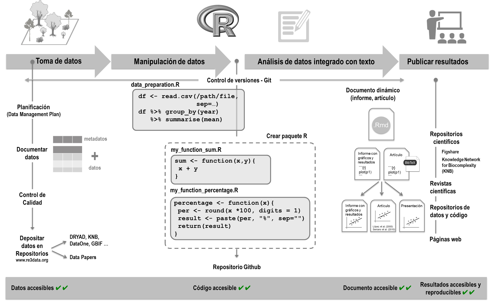

```{r setup, include=FALSE}
library(tufte)
# invalidate cache when the tufte version changes
knitr::opts_chunk$set(cache.extra = packageVersion('tufte'))
options(htmltools.dir.version = FALSE)
```

# Créditos
$I^3$ 
INSTITUTO DE INGENIERÍA INDUSTRIAL
UNIVERSIDAD NACIONAL DE CUYO

^[]

Artículo publicado en Open Access bajo los términos
de Creative Commons attribution Non Comercial License 3.0.

Traducción y REVISIONES

**Título Original**: Ciencia reproducible: ¿ qué, por qué, cómo ?

Publicado originalemente en: REVISTA CIENTÍFICA DE ECOLOGÍA Y MEDIO AMBIENTE

ISSN 1697-2473 / Open access
disponible en www.revistaecosistemas.net

**Autores:** F. Rodríguez-Sánchez1,*, A.J. Pérez-Luque2,**, I. Bartomeus1,**, S. Varela3,**

**Traducción al Español: ** Ricardo R. Palma4

(1) Departamento de Ecología Integrativa, Estación Biológica de Doñana (EBD-CSIC), Consejo Superior de Investigaciones Científicas, Avda. Américo
Vespucio s/n, E-41092 Sevilla, España.
(2) Laboratorio de Ecología (iEcolab), Instituto Interuniversitario Sistema Tierra (CEAMA), Universidad de Granada, Avda. del Mediterráneo s/n, Granada
18006, España.
(3) Departamento de Ciencias de la Vida, Facultad de Biología, Ciencias Ambientales y Química, Universidad de Alcalá, Campus Universitario. Ctra. Madrid-Barcelona, Km. 33,600, 28805 Alcalá de Henares, Madrid, España.
(4) Departamento de traducciones técnicas Centro de Estudios y Aplicaciones Logísticas *CEAL* 
Facutlad de Ingeniería - Universidad Nacional de Cuyo
Mendoza - Argentina

* Autor de correspondencia: F. Rodríguez-Sánchez [frodriguez.work@gmail.com]

** Estos autores contribuyeron de manera equivalente y el orden se determinó ejecutando en R: sample(c("AJPL", "IB", "SV")).
> Recibido el 08 de marzo de 2016 - Aceptado el 12 de junio de 2016


## Objetivos 

Esta traducción y adaptación del trabajo original de Rodriguez-Sanchez et al. es intervenida en esta traducción para ser utilizada en el curso de estímulo de las vocaciones científicas. Se preservan los derechos de los autores originales sobre las partes escritas e incluso sobre las notas de traducción y adaptación al español latinoamericano y portugués del Brasil que el traductor está introduciendo.


## Resumen

La inmensa mayoría de los estudios científicos no son reproducibles: resulta muy difícil, si no imposible, trazar todo el proceso de análisis y obtención
de resultados a partir de un conjunto de datos – incluso tratándose de los mismos investigadores. La trazabilidad y reproducibilidad de los resultados
son sin embargo condiciones inherentes a la ciencia de calidad, y un requisito cada vez más frecuente por parte de revistas y organismos financiadores de la investigación. Los estudios científicos reproducibles incluyen código informático capaz de recrear todos los resultados a partir de los
datos originales. De esta manera el proceso de análisis queda perfectamente registrado, se reduce drásticamente el riesgo de errores, y se facilita
la reutilización de código para otros análisis. Pero la ciencia reproducible no sólo acelera el progreso científico sino que también reporta múltiples
beneficios para el investigador como el ahorro de tiempo y esfuerzo, o el incremento de la calidad e impacto de sus publicaciones. En este artículo
explicamos en qué consiste la reproducibilidad, por qué es necesaria en ciencia, y cómo podemos hacer ciencia reproducible. Presentamos una
serie de recomendaciones y herramientas para el manejo y análisis de datos, control de versiones de archivos, organización de ficheros y manejo
de programas informáticos que nos permiten desarrollar flujos de trabajo reproducibles en el contexto actual de la ecología.

### Palabras clave 
análisis de datos; ciencia abierta; ecoinformática; ecología; programación; R; reproducibilidad

^[**Abstract:** Most scientific papers are not reproducible: it is really hard, if not impossible, to understand how results are derived from data, and being able to regenerate them in the future (even by the same researchers). However, traceability and reproducibility of results are indispensable elements of highquality science, and an increasing requirement of many journals and funding sources. Reproducible studies include code able to regenerate results
from the original data. This practice not only provides a perfect record of the whole analysis but also reduces the probability of errors and facilitates
code reuse, thus accelerating scientific progress. But doing reproducible science also brings many benefits to the individual researcher, including saving time and effort, improved collaborations, and higher quality and impact of final publications. In this article we introduce reproducible science,
why it is important, and how we can improve the reproducibility of our work. We introduce principles and tools for data management, analysis, version
control, and software management that help us achieve reproducible workflows in the context of ecology.]


### Key words
data analysis; ecoinformatics; ecology; open science; programming; R; reproducibility

# Introducción

¿Cuántas veces hemos querido revisitar un análisis estadístico
,meses o años después de haberlo realizado, y no hemos sido capaces; bien porque no
recordamos cómo hacerlo o los datos no están fácilmente disponibles? ¿Cuánto tiempo perdemos en rehacer análisis estadísticos e incluso investigaciones completas,
figuras o tablas tras corregir un error en los datos, o siguiendo las
recomendaciones de un revisor? ¿Cuánto tiempo invertimos intentando implementar un nuevo método de análisis a partir de la escueta descripción proporcionada en un artículo? ¿Cuántas veces
hemos intentado recabar datos infructuosamente porque los autores
han perdido los datos, su formato es ilegible hoy en día, o simplemente se niegan a compartirlos?

```{marginfigure}
**Piensa en esto ...**
  
Sabemos que el teorema fundamental del cálculo infinitesimal se expresa así.


for $x$ in $[a, b]$:
$$\frac{d}{dx}\left( \int_{a}^{x} f(u)\,du\right)=f(x).$$

Pero estaríamos condenado de deducirlo nuevamente si alguien no lo hubiese escrito gentilmente para nosostros hace varios siglos atrás, sólo para que pudiesemos mirar más adelante sobre hombros de gigantes..    
```

Todas estas escenas son desgraciadamente frecuentes en el
día a día de los científicos, y evidencian un grave problema de reproducibilidad en ciencia (Peng 2011). La inmensa mayoría de los
artículos científicos no son reproducibles, esto es, resulta muy difícil o imposible trazar claramente el proceso de obtención de los
resultados y volver a obtenerlos (reproducirlos) ¡incluso tratándose del mismo equipo de autores! En este artículo discutimos
por qué los resultados científicos deben ser reproducibles, presentamos las ventajas de adoptar flujos de trabajo reproducibles,
e introducimos las principales herramientas para ello.


# ¿Qué es la ciencia reproducible?

*“A scientific article is advertising, not scholarship. The actual scholarship is the full software environment, code and data, that produced the result.”*
***Claerbout y Karrenbach (1992).***

La ciencia se caracteriza por seguir unas pautas metodológicas
que garantizan su validez epistemológica (Pigliucci y Boudry 2013).
La confrontación rigurosa de hipótesis con evidencias empíricas (observacionales o experimentales) y el escrutinio público de los resultados contribuyen a garantizar que las conclusiones sean ciertas.
Es por ello que los artículos científicos tienen una sección de métodos explicando los pasos seguidos en la recolección y análisis de
datos. Esta información resulta crucial para examinar la veracidad
y robustez de las conclusiones del artículo, así como para permitir
futuras repeticiones del estudio por otros autores. Sin embargo, en
la mayoría de ocasiones la escueta descripción verbal que aparece
en la sección de métodos resulta insuficiente para conocer todos
los detalles del análisis (Ince et al. 2012, Fig. 1). Este problema resulta cada vez más acuciante con el aumento de la complejidad de
los análisis estadísticos (Michener y Jones 2012).

Un estudio científico es reproducible si el texto del artículo viene
acompañado de código (texto interpretable por un ordenador) que
permite recrear exactamente a partir de los datos originales todos
los resultados y figuras incluidos en el artículo (Peng 2011; Marwick
2016). El concepto es por tanto diferente al de repetibilidad, que se
refiere a la posibilidad de replicar el mismo estudio (con nuevos
datos) a partir de la información proporcionada en el artículo. La
reproducibilidad se relaciona principalmente con la transparencia,
trazabilidad, y completitud del protocolo seguido para llegar a unos
resultados concretos a partir de un conjunto de datos determinado.
La reproducibilidad no es una cualidad binaria sino un gradiente
que va desde trabajos totalmente irreproducibles (que sólo contienen el texto, tablas y figuras finales) a estudios perfectamente reproducibles donde la integración de texto, código y datos permite
regenerar fácilmente el resultado final a partir de los datos originales (e.g. Goring et al. 2013; FitzJohn et al. 2014, Fig. 1).

#¿Por qué es necesaria la reproducibilidad en ciencia?

“Every analysis you do on a dataset will have to be redone 10-15
times before publication. Plan accordingly.” Trevor A. Branch.

La reproducibilidad es un pilar fundamental del método científico: los resultados deben estar basados en datos y evidencias perfectamente contrastables. De hecho, ningún estudio científico puede garantizar que sus resultados sean correctos, pero sí reproducibles (Peng 2011). 
La reproducibilidad es por tanto una garantía
de transparencia y calidad: los artículos reproducibles están mejor
blindados frente a errores, y cuando los contienen son detectados
y corregidos más fácilmente (Check Hayden 2015). Además, la reutilización de código pre-existente por parte de otros autores contribuye a acelerar el progreso científico. En los últimos años ha
aumentado la presión por incrementar la reproducibilidad de los trabajos científicos, tras la creciente detección de errores graves en
artículos que carecen de garantías de reproducibilidad (Anónimo
2014a; b; Alberts et al. 2015). De hecho, el número de revistas y
fuentes de financiación que requieren la publicación de datos y código no para de crecer (Stodden et al. 2013).

Pero la reproducibilidad no debería ser vista como una obligación impuesta externamente, sino como una oportunidad de mejorar nuestra manera de hacer ciencia y aumentar la contribución de
nuestros trabajos al avance científico general. Hacer ciencia reproducible trae consigo múltiples ventajas para el investigador (ver
Tabla 1), a pesar del esfuerzo inicial que siempre conlleva aprender
nuevas técnicas de trabajo.

Para empezar, tener flujos de trabajo reproducibles evita muchos de los problemas planteados al comienzo de este artículo.
Por ejemplo, tras corregir un error en los datos o introducir nuevas observaciones podemos volver a generar -sin ningún esfuerzo extra- todas las tablas, figuras y resultados de un trabajo.
Esto no sólo ahorra tiempo sino que disminuye drásticamente los
errores en el manuscrito final. Igualmente, la existencia de un código que documenta fielmente el proceso de análisis facilita tanto
la escritura del manuscrito como su interpretación por coautores,
revisores y lectores finales (Markowetz 2015). Además, dicha
transparencia le da un sello de calidad al trabajo y facilita su aceptación, incrementando su impacto posterior en términos de citas y
reconocimiento (Piwowar et al. 2007; Vandewalle 2012). Por ejemplo, la revista Molecular Ecology menciona en sus instrucciones a
los autores que “los artículos con archivado de datos y código son
más valiosos para investigaciones futuras, por lo que, a igualdad
de condiciones, se les dará mayor prioridad para su publicación”.
La existencia de un código ordenado y bien estructurado permitirá
además su reutilización en proyectos posteriores, ahorrando
tiempo y esfuerzos al equipo de investigación (Garijo et al. 2013).
Además, compartir públicamente el código con el que generamos
unos resultados puede ayudarnos a identificar errores (idealmente
antes de su publicación) y abrir nuevas líneas de colaboración
(Hampton et al. 2015).


^[Figura 1. La reproducibilidad no es una cualidad binaria sino un gradiente (Peng 2011). Los artículos científicos que sólo contienen el texto, resultados y
figuras finales (por ejemplo en un único archivo pdf) son los menos reproducibles: es imposible reconstruir detalladamente el proceso de análisis desde
los datos originales hasta los resultados finales. La publicación de los datos y/o el código empleado para el análisis contribuyen a mejorar la reproducibilidad. Igualmente, la existencia de un sistema de control de versiones (como git) permite reconstruir perfectamente la historia del proyecto. Finalmente,
en el extremo del gradiente de reproducibilidad se encuentran los documentos dinámicos (por ejemplo, Rmarkdown o IPython) que integran perfectamente
texto, datos y código ejecutable.]

Figure 1. Reproducibility is not a binary quality but a gradient (Peng 2011). Scientific articles that contain only the final text, results and figures (e.g. in a
single pdf document) are the least reproducible - it is impossible to reconstruct the whole analytic process from data to results. Publication of the data
and/or code used for the analysis greatly improve reproducibility. Likewise, usage of a version control system (like git) permits navigating through the
complete history of the project. Finally, the most reproducible studies are those using dynamic reports (e.g. Rmarkdown or IPython notebooks) that integrate
text, code and data in a fully executable environment.


Tabla 1. Ventajas para el investigador derivadas de la adopción de flujos de trabajo reproducibles.
Table 1. Personal benefits for researchers from developing reproducible workflows.


<table>
 <thead>
  <tr>
   <th style="text-align:left;">Beneficios de la ciencia reproducible para el investigador   </th>
   
   <th style="text-align:left;"> Beneficios para la organiacion patrocinante </th>
   
  </tr>
 </thead>
<tbody>
  <tr>
   <td style="text-align:left;"> • La utilización de código permite la automatización: ejecución de tareas repetitivas sin esfuerzo</td>
   <td style="text-align:right;">  • El sistema de bibliotecas institucional simplifica la generación de tesauros y la indexación correcta </td>
  
  </tr>
  <tr>
   <td style="text-align:left;">  • Reducción drástica del riesgo de errores </td>
   <td style="text-align:right;"> • Posibilidades de desarrollo para nuevos tesistas en base a errores detectados </td>
   </tr>
   
    <tr>
   <td style="text-align:left;">  • Muy fácil corregir y regenerar resultados, tablas y figuras </td>
   <td style="text-align:right;"> • El investigador se centra en el textos que permite comunicar a la comunidad epistémica y se olvida del formato (documento, pagina web, diapositiva, poster). Se  conservando la línea editorial de la Universidad, logos, filiación, etc </td>
   </tr>
   

  <tr>
   <td style="text-align:left;">  • Los flujos de trabajo reproducibles facilitan la colaboración </td>
   <td style="text-align:right;"> • La mayor porductividad, visibilidad y calidad de los trabajos apoyan a los procesos de acreditación de la institución.  </td>
   </tr>
   

  
   <tr>
   <td style="text-align:left;">  • Mayor facilidad para escribir artículos al tener registro exhaustivo de todo el proceso de análisis </td>
   <td style="text-align:right;"> • Aporta transparencia a los procesos de los modelos de triple hélice en los que interviene la academia.  </td>
   </tr>
     

  <tr>
   <td style="text-align:left;">  • La publicación del código y modelos utilizados ayuda a detectar errores antes de la publicación definitiva • La publicación del código facilita el proceso de revisión </td>
   <td style="text-align:right;"> • Preserva para generaciones futuras los entretelones del proceso de avance cientifico de una comunidad epistémica.  </td>
   </tr>
     
   
   
</tbody>
</table>


^[La reproducibilidad es un sello de calidad y aumenta la probabilidad de aceptación (cuando no es simplemente requerida)
La reproducibilidad aumenta el impacto de las publicaciones (citas, reconocimiento, reutilización, coautorías)
Ahorro de tiempo y esfuerzo al reutilizar modelos código y conjeturas en otros proyectos]


# ¿Editoriales y autoría?

Si bien a los ojos del autor, el proceso deselección es algo que parecería no competerle, la realidad muestra todo lo contrario.
En primer lugar recuerda que si están iniciando el camino de las ciencias, más pronto de lo que crees ejercerás el rol de revisor.

Conocer los criterios por lo que las editoriales se rigen es entender ćomo hacen ellos para evitar asumir riesgos por fallas éticas o epistémicas, que de ocurrir comprometerían el prestigio y reputación de una revista o un libro editado por ellos.

Veamos un mapa mental de los criterios que una una de las prestigiosas revista más relevantes en el campo de la ingeniería industrial.


Link a vista ampliada del mapa mental
[Vista Mapa Mental](Editorial.svg)

Como se puede ver los tres pilares que sustentan la selección están basado en la **ética** , la reputación del **autor** (el término en inglés que se utiliza es **authorship**) y finalmente lo que nos ocupa en este texto que es la
**reproducibilidad**.


^[En la teoría literaria, los críticos encuentran complicaciones en el término autor más allá de lo que constituye la autoría en un marco legal. A raíz de la literatura posmoderna, críticos como Roland Barthes y Michel Foucault han examinado el papel y la relevancia de la autoría para el significado o la interpretación de un texto.
Barthes cuestiona la idea de que un texto pueda ser atribuido a un único autor. Escribe, en su ensayo "La muerte del autor" (1968), que "es el lenguaje el que habla, no el autor".[6] Las palabras y el lenguaje de un texto en sí determinan y exponen el significado para Barthes, y no alguien. poseyendo la responsabilidad legal por el proceso de su producción. Cada línea de texto escrito es un mero reflejo de referencias de cualquiera de una multitud de tradiciones o, como dice Barthes, "el texto es un tejido de citas extraídas de los innumerables centros de cultura"; nunca es original.]

# Cómo hacer ciencia reproducible

*“You can’t reproduce if you don’t understand where a number came
from. You can’t reproduce what you don’t remember. And trust me: you
won’t. You can’t reproduce what you’ve lost. What if you need access to a
file as it existed 1, 10, 100, or 1000 days ago?”*
***Bond-Lamberty (2014).***

Adoptar un flujo de trabajo reproducible (Fig. 2) requiere un esfuerzo inicial importante. Es necesario familiarizarse con diversas
herramientas (bases de datos, programación, sistemas de control
de versiones) lo cual lleva su tiempo. Recibir una formación adecuada y temprana (idealmente previa a la realización del proyecto
de máster o doctorado) facilita mucho las cosas. Dado que el interés por la ciencia reproducible es bastante reciente, en nuestro país
la formación es aún escasa, aún más en el campo de la ecología.
Pero existen cursos, libros y material de aprendizaje fácilmente disponibles (ver Apéndice 1).

La reproducibilidad no es una cualidad binaria sino un gradiente
(Fig. 1) y conviene implementarla paso a paso en nuestra investigación para facilitar la transición (Tabla 2). Un ejemplo extremo de
irreproducibilidad sería aquel donde los datos son manipulados en
una hoja de cálculo (e.g. Microsoft Excel, LibreOffice Calc), posteriormente analizados manualmente en programas estadísticos
(como Statistica o SPSS), el manuscrito redactado en un procesador de texto (e.g. Microsoft Word, Google Docs), las figuras realizadas en un programa gráfico (e.g. SigmaPlot, Adobe Illustrator,
Photoshop), y los valores de las tablas copiados a mano. Afortunadamente, cada vez es más frecuente que los análisis se hagan mediante código (mayoritariamente R o Python), lo cual representa un
avance importante en cuanto a reproducibilidad. Sin embargo, dicho
flujo de trabajo incluye todavía múltiples pasos manuales que rompen su dinamismo, no dejan registro de las operaciones realizadas,
y abren la puerta a la introducción de errores (por ejemplo, al copiar
manualmente múltiples valores a una tabla). En el otro extremo de
este gradiente de reproducibilidad estarían los análisis puramente
integrados donde el trabajo final puede ser reconstituido a partir de
los datos originales con un solo comando o clic del ratón (Fig. 1).
A continuación presentamos los elementos más importantes de
un flujo de trabajo reproducible (Fig. 2, Tabla 2) e introducimos las
principales herramientas disponibles para el manejo de datos, análisis de datos mediante código, control de versiones, la organización
de los archivos, y el manejo de las dependencias de software externo. En el Apéndice 1 hemos incluido un listado de recursos que
profundizan más en cualquiera de estos aspectos.

## Recolección y manejo de datos

El proceso de recolección y manejo de datos resulta crucial, ya
que cualquier error en esta primera etapa se propagará hasta los
resultados finales. Por tanto es muy importante garantizar la calidad
de este proceso, que podría dividirse en cinco etapas (Michener y
Jones 2012):

### Planificación

Una buena planificación es la mejor forma de asegurar la calidad de los datos, multiplicando su valor durante y después de finalizado el proyecto (Rüegg et al. 2014). Muchas instituciones
(como la National Science Foundation de Estados Unidos) requieren la presentación de un ‘data management plan’ con cada proyecto (http://www.nsf.gov/bio/biodmp.jsp). Dicho plan debe incluir
información detallada acerca de qué datos se van a obtener y cómo
van a recogerse, almacenarse y compartirse (Michener y Jones
2012; Michener 2015) (por ejemplo véase https://www.dataone.org/
sites/all/documents/DMP_Copepod_Formatted.pdf). Para ello, existen herramientas como DMPTool (https://dmptool.org/) muy útiles
para elaborar esta planificación.

### Recolección

El proceso de obtención de datos ecológicos varía enormemente según el tipo de estudio, desde la captura de organismos en
el campo hasta la descarga de imágenes de satélite. A pesar de
esta heterogeneidad, un principio común a seguir es intentar conservar los datos brutos en su estado original de la mejor manera
posible (por ejemplo, insectos capturados en un museo o una colección, fichas de campo en un archivo seguro, imágenes o capas
GIS en un repositorio), con un identificador único. Esto nos permite
establecer claramente qué conjunto de datos se ha utilizado para
un análisis, así como revisar/reutilizar estos datos en el futuro.
Igualmente, la metodología de obtención de datos debe quedar perfectamente registrada.

### Descripción del conjunto de datos (metadatos)

Todo conjunto de datos debe ir acompañado de una descripción
detallada de lo que representa cada variable, cómo y dónde se
tomó, en qué unidades está medida, cuándo se tomaron los datos,
quien los tomó, etc. Esta información, conocida como metadatos,
resulta necesaria para una correcta interpretación de los datos (Michener et al. 1997), y además multiplica su utilidad favoreciendo la
reutilización (Fegraus et al. 2005; Alonso y Valladares 2006; Rüegg
et al. 2014).

```{r  fig.width = 10, fig.height = 2, fig.fullwidth = TRUE, fig.cap = "Fig. 2 - Flujo asistido de implementación.", warning=FALSE, message=FALSE, echo=FALSE, cache=TRUE, out.width='100%'}


```


Figura 2. Esquema de un flujo de trabajo reproducible. En primer lugar, los datos se recogen según un protocolo bien diseñado, se documentan con metadatos (e.g. usando el estándar EML, ‘Ecological Metadata Language’), se someten a un control de calidad (idealmente de manera automática, esto es,
mediante funciones de código), y se almacenan en un repositorio de datos en la nube. Después procederíamos al análisis, siempre utilizando ‘scripts’
para manipular los datos, y creando funciones que pueden almacenarse en un paquete (para facilitar su documentación y posterior reutilización). El
análisis propiamente dicho se haría mediante documentos de Rmarkdown o IPython que integran texto, código y resultados (tablas y figuras). Estos documentos pueden convertirse fácilmente en presentaciones, páginas web, o artículos científicos plenamente reproducibles.
Figure 2. Sketch of a reproducible data analysis workflow. First, data are collected following a well-designed plan, documented with metadata (e.g. using EML,
the Ecological Metadata Language), quality-controlled (ideally through automated functions), and stored in an online repository. For the data analysis, we would
always use scripts for data wrangling and preparation, as well as functions to perform repeated tasks. These functions could be wrapped into a package to facilitate their share and reuse. The actual analysis would be done using literate programming (e.g. Rmarkdown or IPython). These documents integrate text,
code and results (tables and figures) and are fully executable, so they can be easily converted into presentations, web pages, or fully reproducible manuscripts.

Aunque los metadatos pueden alojarse en un simple fichero de
texto, es muy conveniente utilizar un sistema estándar pues facilita
la validación, integración y síntesis de los datos de manera automatizada (Alonso y Valladares 2006).


^[El hecho de escribir tus paper con procesadores de texto como *MS Word* y guardarlos en formato PDF para publicarlos en journals o enviarlos a congresos genera una archivo que desde el punto de vista de los metadatos es **"mudo"**. Esto es aún más cierto si utilizas *MS 365*. Crear datos con R-Cran o Jupyer Notebooks  incrementa tu reputación (índice h) y garantiza prestigio para la organización en la que registres tu filiación.]

Existen diferentes estándares
de metadatos en función del propósito y la disciplina científica.
En el terreno de las ciencias aplicadas todos los Journals de Elsevier que utilizan la plantilla Lecture Notes in Computer Sciences y las plantillas que ofrece la IEEE facilitan la busqueda y clasificación del conocimiento. 
En ecología y ciencias de la vida en general existe el estándar llamado ‘Ecological Metadata Language’
(EML) (http://knb.ecoinformatics.org/software/eml/) que se utiliza
por ejemplo en las redes de seguimiento ecológico a largo plazo
(LTER, Long-Term Ecological Research; Vanderbilt et al. (2015)).
Existen varias herramientas para crear o editar metadatos, como
Morpho (http://knb.ecoinformatics.org/morphoportal.jsp), DEIMS
(https://data.lter-europe.net/deims/, utilizado en la red LTER), o el
paquete de R eml (https://github.com/ropensci/EML/).

### Control de calidad

El control de calidad de los datos es un paso imprescindible
pero frecuentemente obviado. Siempre se introducen errores, ya
sea en la toma de datos en el campo o al introducirlos en un ordenador, y es importante detectarlos y depurarlos. La utilización de
plantillas que restrinjan el tipo de datos introducido (e.g. fecha en
un formato determinado, valores numéricos dentro de un rango
determinado, especie a elegir de un listado predefinido) evita la introducción de muchos errores desde el principio. En cualquier
caso, es conveniente realizar un control de calidad final comprobando que todos los datos se ajustan a unos valores adecuados o
razonables. Este control de calidad puede hacerse de manera reproducible e iterativa mediante funciones de importación de datos
que incluyen tests para comprobar la validez de los datos (e.g. ver http://ropensci.org/blog/2015/06/03/baad). 

^[Además, es importante
seguir algunas normas básicas de estructuración de la base de
datos (Wickham 2014) para facilitar su análisis posterior (e.g. ver
http://kbroman.org/dataorg/ o http://www.datacarpentry.org/spreadsheet-ecology-lesson/).]

### Preservación

Finalmente, debemos buscar la forma de asegurar que nuestros datos seguirán estando disponibles a largo plazo. Un estudio
reciente (Vines et al. 2014) estimó que la disponibilidad de los
datos se reduce con el tiempo a una alarmante tasa anual del
17 %. En muchos casos, la dificultad de acceso a los datos se
debe a su almacenamiento en formatos propietarios o dispositivos
digitales obsoletos; otras veces simplemente se extravían. Actualmente, la mejor manera de asegurar la persistencia de los datos
a largo plazo (White et al. 2013; Hart et al. 2016) es alojarlos en
formato abierto (e.g. txt o csv para datos tabulados, png para imágenes) en un repositorio oficial de los muchos que hay disponibles (ver http://www.re3data.org/). Muchos de estos repositorios
están orientados a la difusión pública de los datos, pero otros permiten alojamiento privado (e.g. Figshare, KNB, Open Science

Framework). Estos repositorios otorgan un identificador único y
persistente (DOI, Digital Object Identifier) a los datos, facilitando su
reutilización y citación. Existen múltiples programas que permiten
subir, actualizar y descargar datos fácilmente desde estos repositorios (e.g. ver http://ropensci.org/packages/#data_publication). El
alojamiento en la nube representa por tanto la mejor opción para
la conservación de los datos (Hart et al. 2016).


Tabla 2. Criterios y recomendaciones para incrementar la reproducibilidad de nuestra investigación.
Table 2. Checklist of criteria and recommendations to increase the reproducibility of our research.


Criterios de reproducibilidad

Los datos originales están disponibles
Los datos han sido revisados y validados (preferiblemente de manera automática)
Existe un conjunto de metadatos explicando la estructura, formato y contenido de los datos
Los datos están almacenados en formato abierto (e.g. txt, csv)
Los datos se han subido a un repositorio en la nube
Todo el análisis y manejo de datos se hace mediante código (‘scripts’)
El código es inteligible y está bien documentado
El código genera las tablas y figuras finales
Todos los resultados del trabajo se actualizan dinámicamente (nunca manualmente)
Todos los archivos importantes (datos, código) están versionados (por ejemplo usando git)
Existe copia de seguridad de todos los archivos importantes en (cuasi) tiempo real
Todos los archivos relacionados con el proyecto están dentro del mismo directorio
Existen subdirectorios independientes para los datos, código, figuras, etc.
Los datos brutos están separados de los datos derivados
El código utiliza funciones que se definen en un fichero independiente
Se han escrito tests que comprueban que las funciones actúan correctamente
Existe un ‘script’ maestro que ejecuta todos los pasos del análisis ordenadamente
Existe un documento README que explica los objetivos y organización del proyecto
Existe un registro detallado de todas las dependencias de software externo (incluyendo la versión)
Es posible instalar todas esas dependencias en el futuro o en otro ordenador
Tanto el manuscrito como los datos y código son públicos
Se especifica el tipo de licencia que tienen los datos y el código

## Análisis de datos y documentos dinámicos

Para que un estudio sea reproducible, todo el análisis debe realizarse mediante ‘scripts’ de código, desde la manipulación de
datos hasta la generación de tablas y figuras. Eso significa que debemos evitar hacer ningún cambio directamente sobre los datos
originales (e.g. en una hoja de cálculo como Microsoft Excel): los
datos originales son intocables, y cualquier modificación posterior
debe realizarse mediante código de manera que quede un registro
de todos los cambios realizados.

La utilización de código trae consigo una serie de ventajas
frente al análisis manual mediante clics. En primer lugar, el análisis
manual es totalmente irreproducible, a diferencia del código que es
interpretable tanto para humanos como computadoras. El código
contiene un registro perfecto de todos los pasos seguidos en el
análisis, muy útil para compartir con colaboradores o reutilizar algún
tiempo después (siempre que podamos reproducir el entorno de
computación, véase sección de dependencias externas más abajo).
Además, la utilización de código permite automatizar tareas, ahorrando tiempo al investigador.

En muchas disciplinas científicas el lenguaje de
programación dominante desde hace años es R (www.r-project.org).
R es un lenguaje gratuito, de código abierto, inicialmente dirigido al
análisis de datos y la visualización, pero cuyos usos no paran de
crecer gracias a una comunidad muy activa de usuarios-desarrolladores que contribuyen sus propios ‘paquetes’ con funciones (ver
https://cran.r-project.org/web/packages/available_packages_
by_name.html). Además de R, existen otros lenguajes de programación bastante extendidos como Python, C, C++, MATLAB, etc.
(Bass y Nixon 2008).


La aparición en el último lustro de herramientas para generar
documentos dinámicos a partir de un conjunto de datos y código
(knitr y rmarkdown en R, IPython para Python, Jupyter para múltiples lenguajes) ha supuesto una auténtica revolución en el campo
de la ciencia reproducible. Estos programas integran texto y código
de manera que es posible regenerar todas las tablas, figuras y resultados presentes en un artículo, libro o informe con un solo clic
(Fig. 3). Ello nos libra por tanto de tener que volver a copiar manualmente todos los valores de una tabla o rehacer figuras con
cada iteración del análisis. Por tanto, utilizar documentos dinámicos
no sólo ahorra tiempo sino que también reduce la probabilidad de
cometer errores: todos los resultados son perfectamente trazables
a partir de los datos originales.

```{r  fig.width = 10, fig.height = 2, fig.fullwidth = TRUE, fig.cap = "Fig. 3 - Ejemplo de RMarkdown.", warning=FALSE, message=FALSE, echo=FALSE, cache=TRUE, out.width='100%'}


```


En el caso concreto de R, la integración de rmarkdown en
Rstudio (www.rstudio.com) facilita la tarea de escribir artículos,
tesis, páginas web e incluso presentaciones totalmente reproducibles (véase http://rmarkdown.rstudio.com). A modo de ejemplo,
este artículo está escrito íntegramente en Rmarkdown (véase el
código fuente aquí: https://github.com/ecoinfAEET/Reproducibilidad). Aquí (https://github.com/Pakillo/rmdTemplates) puede descargarse una plantilla para escribir artículos en Rmarkdown para la
revista Ecosistemas.

# Control de versiones

“Your closest collaborator is you 6 months ago, and you don’t respond
to emails.” P. Wilson.

El control de versiones es otro de los nudos conflictivos a lo
largo del desarrollo de un proyecto. El sistema más común -y problemático- de control de versiones consiste en guardar copias de
los ficheros con distintos nombres (Fig. 4), en un intento de tener
un archivo de todos los cambios aplicados al documento. Este sistema lleva a la acumulación desmesurada de archivos muy similares cuyas modificaciones no son fácilmente comparables, y dificulta
reconstruir la historia del proyecto, volver atrás en caso de detectar
errores, o colaborar con varios coautores haciendo modificaciones
sobre el mismo documento. Herramientas como Google Docs,
Dropbox, Overleaf o Authorea representan un gran avance al respecto, pero están más enfocadas a la escritura colaborativa de manuscritos que a la integración dinámica de datos, texto y código
ejecutable como en los documentos de Rmarkdown o IPython.
Los sistemas de control de versiones se encargan de monitorizar automáticamente los cambios realizados en cualquier fichero,
registrando quién hizo qué cambio, cuándo y por qué (Blischak
et al. 2016), de forma que es posible recuperar distintas versiones
del fichero en todo momento. En el campo de la programación exis-


Figura 3. Los documentos dinámicos que integran texto, código y resultados (e.g. Rmarkdown, IPython) son una herramienta revolucionaria para hacer
ciencia reproducible. Por ejemplo, un archivo Rmarkdown que contiene texto y código (a) puede ejecutarse y producir automáticamente documentos integrados
(b) en múltiples formatos incluyendo html, pdf, o Word. Los documentos Rmarkdown permiten trazar todo el proceso desde los datos originales a los resultados,
y son plenamente reproducibles de manera que si hacemos cualquier cambio en los datos o el código, los resultados se actualizan automáticamente.

Figure 3. Dynamic documents integrating text, code and results (e.g. Rmarkdown, IPython) are revolutionary tools for reproducible science. For example,
an Rmarkdown document (a) contaning text and code can be automatically converted into an integrated document with text, code and results (b) in one
of multiple formats including html, pdf, and Word. Rmarkdown documents are fully reproducible: they permit tracing exactly how results are derived from
data, and if we change anything in the data or code, results will be updated automatically.

Figura 4. Almacenar copias de archivos con distintos nombres (a) es un sistema de control de versiones muy ineficiente. El número de archivos crecerá
desmesuradamente, y no es fácil comparar los cambios entre distintos archivos o reconstruir la historia del proyecto. Existen sistemas de control de versiones
muy eficientes (como git) que registran perfectamente quién hizo qué cambio, cuándo y por qué (b). Cuando se sincronizan con plataformas en línea
como GitHub (www.github.com), resulta muy fácil trabajar conjuntamente en proyectos incluyendo manejo de datos, análisis y redacción de artículos.

Figure 4. Storing file copies with distinct names (a) is a very inefficient system of version control. The number of files will grow fast, and it is hard to
compare changes between files, or navigate the history of the project. In contrast, version control systems such as git are very efficient to record who did
what change, when, and why (b). When used in conjunction with online platforms like GitHub (www.github.com), it is easy to work collaborately in research
projects involving data management, analysis, and manuscript writing.


existen sistemas de control de versiones muy eficientes que recientemente se han incorporado como herramientas básicas de la ciencia
reproducible (Ram 2013). Git (https://git-scm.com/) es el sistema
más utilizado hoy día, en conjunción con plataformas de internet
como GitHub (https://github.com), BitBucket (https://bitbucket.org/),
o GitLab (https://gitlab.com/). Git facilita enormemente la tarea de
archivar, reconstruir y navegar por la historia de un proyecto. La integración de git en plataformas como GitHub facilita además enormemente el desarrollo conjunto de análisis, código y texto entre
todos los colaboradores de un proyecto. A modo de ejemplo, este
artículo se escribió utilizando git para el control de versiones y
GiHub para la colaboración y discusión entre los autores. El desarrollo completo del artículo (incluyendo quién hizo qué cambios,
cuándo y por qué) está disponible públicamente en GitHub:
https://github.com/ecoinfAEET/Reproducibilidad/commits/master.
Organización de ficheros

Mantener un sistema consistente de organizar todos los archivos relacionados con un proyecto es otro punto importante para garantizar su reproducibilidad (y hacer la vida del investigador más
fácil). Cuando no se tiene ningún criterio los archivos se acumulan
desordenadamente y resulta muy difícil manejar los distintos componentes del proyecto (datos, código, figuras, texto...). Esto no sólo
dificulta la comprensión y reutilización en el futuro, sino que también
favorece la aparición de errores incontrolados.

Hay muchas maneras de organizar un proyecto, y cada investigador elige la más conveniente en su caso. Pero sí existen algunos principios básicos (Noble 2009, véase también enlaces en
Apéndice 1): (i) todos los ficheros relacionados con el proyecto
deben estar dentro del mismo directorio (e.g. un proyecto de Rstudio); (ii) existen subdirectorios independientes para los datos, código, figuras, resultados y manuscrito; (iii) los datos originales
permanecen inalterados en un directorio aparte; (iv) los datos derivados se generan mediante ‘scripts’; (v) las funciones se definen
en ficheros independientes del código que ejecuta el análisis; (vi)
en el directorio raíz hay un fichero README que describe el proyecto y sus componentes, y un ‘script’ maestro (‘makefile’) que ejecuta todos los análisis.

Convenientemente, todos estos principios son compatibles con
la estructura de un paquete de R (Fig. 5). Un paquete de R no es
más que una forma estándar de organizar el código que nos permite ser más eficientes a la hora de utilizarlo, compartirlo y editarlo
(Varela 2015). Todos los paquetes de R tienen una estructura estándar con una carpeta ‘R’ donde residen las funciones, una carpeta ‘man’ que contiene los ficheros de ayuda de esas funciones,
un fichero de texto ‘NAMESPACE’ (generado automáticamente)
que especifica las funciones contenidas en el paquete y si dependen de funciones contenidas en otros paquetes, y un fichero ‘DESCRIPTION’ con los metadatos del paquete: nombre, objetivos,
autores, y sus dependencias de otros paquetes. Además pueden
añadirse carpetas incluyendo archivos de datos, tests para las funciones, etc. (Wickham 2015) por lo que la estructura, siendo estándar, mantiene su flexibilidad.

Crear un paquete de R es mucho más fácil de lo que puede parecer (ver Apéndice 2), y organizar un proyecto de investigación utilizando esa estructura estándar tiene muchas ventajas (cf. https://
github.com/ropensci/rrrpkg), entre ellas: (i) el paquete provee una estructura de directorios para mantener los archivos organizados; (ii)
las funciones creadas para el análisis quedan documentadas, facilitando su reutilización posterior; (iii) las funciones pueden llevar tests
asociados para comprobar que funcionan correctamente, incrementando la robustez del análisis; (iv) se describen explícitamente las
dependencias de nuestro análisis en otros paquetes o programas
externos, facilitando la reproducibilidad del proyecto.
Dependencias externas

Todo análisis reposa sobre plataformas, paquetes o programas
que cambian a lo largo del tiempo. En consecuencia, es muy frecuente que un código deje de funcionar al introducirse cambios en
alguno de los paquetes de los que depende el proyecto (Ooms


Figura 5. Organización de directorios y archivos en un proyecto siguiendo
la estructura de un paquete de R. Los datos brutos no deben modificarse y
se encuentran separados de los datos depurados, que se generan mediante
‘scripts’. Las funciones se definen en ficheros independientes (carpeta R),
y van acompañadas de documentación (carpeta man) y tests (para comprobar que funcionan adecuadamente). Los análisis se realizan mediante documentos Rmarkdown. Existe un script maestro (makefile) que ejecuta el
análisis (completo o por partes). Esta estructura es flexible y puede modificarse según las preferencias del investigador (e.g. ver https://github.com/ropensci/rrrpkg).

Figure 5. Organisation of files and folders for a research project following
the structure of an R package. Raw data are separated from derived (clean)
data, which are obtained through scripts. Functions are defined as independent files (R folder), have documentation (man folder) and tests (to check
that they work correctly). Analyses are done in Rmarkdown. There is also a
makefile that executes all or parts of the analysis. This structure is flexible
and highly customisable to follow preferences of the researcher (e.g. see
https://github.com/ropensci/rrrpkg).

2013). Igualmente, para poder reproducir un análisis en otro ordenador habrá que instalar primero todas los programas necesarios.
Por estos motivos conviene documentar las dependencias externas
de nuestro análisis (por ejemplo qué paquetes de R se utilizan, especificando la versión), y asegurarse de que dicho software estará
disponible en el futuro.

Hay muchas maneras posibles de registrar las dependencias
de nuestro proyecto. En R, una de las más sencillas es ejecutar la
función sessionInfo() (o su equivalente session_info del paquete devtools) al finalizar el análisis. Este comando devuelve un
listado estructurado de todos los paquetes utilizados, especificando
su versión. Esta información puede ser procesada directamente por
paquetes como switchr (Becker et al. 2015) para instalar todas
las dependencias requeridas en cualquier otro ordenador. Otras opciones incluyen el uso de los paquetes rctrack (Liu y Pounds
2014), checkpoint (Revolution Analytics 2015) y packrat (Ushey
et al. 2015). Mientras rctrack y packrat almacenan una copia
local de todos los paquetes utilizados en un proyecto, checkpoint
descarga los paquetes desde un servidor de internet cuando se ejecuta. Todos estos métodos son muy fáciles de utilizar y garantizan
la reproducibilidad de nuestro proyecto en el futuro aunque cambien
los paquetes o dependencias externas. Otras alternativas más
avanzadas y versátiles incluyen docker (Boettiger 2015) y drat
(Eddelbuettel 2015). En el Apéndice 1 hemos incluido enlaces para
iniciarse en el uso de todas ellas.

Conclusiones

La trazabilidad y reproducibilidad de los resultados científicos
son cualidades inherentes a la ciencia de calidad. Hacer ciencia
de manera reproducible no sólo es un requisito creciente en muchas revistas y fuentes de financiación sino que además aporta
muchas ventajas para el investigador. A la larga, la ciencia reproducible ahorra tiempo y esfuerzo, reduce el riesgo de cometer
errores y aumenta el impacto y utilidad de los trabajos en la comunidad científica.

Desarrollar estudios plenamente reproducibles requiere un esfuerzo inicial de aprendizaje. Creemos que aquí se aplica bien la
máxima de que ‘es importante aprender a nadar antes de estar


hundiéndonos’. Invertir esfuerzo en adoptar flujos reproducibles
puede parecer una pérdida de tiempo al principio, pero en el futuro
puede ahorrarnos muchos problemas. El tiempo invertido en aprender a utilizar herramientas como git o rmarkdown se ve recompensado cuando podemos regenerar todo un manuscrito, tablas y
figuras incluidas, con un solo clic. No solo ahorramos esfuerzo,
sino que nos aseguramos de que los resultados están actualizados
y libres de errores.

La transición hacia la reproducibilidad puede hacerse gradualmente. Un buen punto de partida es la utilización de código
(‘scripts’) para todo el proceso de manejo y análisis de datos, así
como producción de figuras. Este código debe ser capaz de generar los resultados finales a partir de los datos originales, y
ambos pueden publicarse junto con el manuscrito para hacerlo
más reproducible. Igualmente, podríamos empezar a utilizar repositorios de datos en la nube (e.g. Open Science Framework,
Figshare) para almacenar, versionar y compartir nuestros datos.
El siguiente paso podría ser estructurar nuestro código en un documento dinámico (Rmarkdown/IPython). Finalmente puede incorporarse un sistema de control de versiones (e.g. git/GitHub)
para guardar un registro del desarrollo del proyecto y facilitar la
colaboración con otros investigadores.

Esperamos que este artículo anime a muchos investigadores
a adoptar estas prácticas, y que las pautas y recursos aquí recogidos faciliten la transición hacia una ciencia más reproducible.

Agradecimientos

FRS está financiado por una ayuda de formación postdoctoral
del Ministerio de Economía y Competitividad. SV tiene un contrato
postdoctoral del programa propio de la Universidad de Alcalá. Los
autores desean agradecer expresamente a todos los programadores, instituciones y empresas que hacen posible, muchas veces de
manera altruista, la ciencia reproducible.

Referencias

Alberts, B., Cicerone, R.J., Fienberg, S.E., Kamb, A., McNutt, M., Nerem,
R.M., Schekman, R. et al. 2015. Self-correction in science at work. Science 348: 1420-1422.
Alonso, B., Valladares, F. 2006. Bases de datos y metadatos en ecología:
compartir para investigar en cambio global. Ecosistemas 15: 1-6.
Anónimo 2014a. Code share. Nature 514: 536-536.

Anónimo 2014b. Journals unite for reproducibility. Nature 515: 7-7.

Bass, B., Nixon, T. 2008. Computer languages. En Jorgensen, S., Fath, B.
(eds.), Encyclopedia of ecology, pp. 720-731.
Becker, G., Barr, C., Gentleman, R., Lawrence, M. 2015. Enhancing reproducibility and collaboration via management of R package cohorts. Arxiv,
http://arxiv.org/abs/1501.02284v2.

Blischak, J.D., Davenport, E.R., Wilson, G. 2016. A Quick Introduction to
Version Control with Git and GitHub. PLOS Computational Biology 12:
e1004668.
Boettiger, C. 2015. An introduction to Docker for reproducible research. ACM
SIGOPS Operating Systems Review 49: 71-79.

Bond-Lamberty, B. 2014. Robust and reproducible research using R.
http://rstudio-pubs-static.s3.amazonaws.com/14911_24ffedb
113f74789b709cbd694dc255c.html#/

Check Hayden, E. 2015. Rule rewrite aims to clean up scientific software.
Nature 520: 276-277.

Claerbout, J., Karrenbach, M. 1992. Electronic documents give reproducible
research a new meaning. En: Proceedings of the 62nd annual international meeting of the society of exploration geophysics, Octubre 1992,
New Orleans, Estados Unidos. pp. 601-604.

Eddelbuettel D. 2015. drat: Drat R Archive Template. https://cran.rproject.org/package=drat.

Fegraus, E.H., Andelman, S., Jones, M.B., Schildhauer, M. 2005. Maximizing the Value of Ecological Data with Structured Metadata: An Introduction to Ecological Metadata Language (EML) and Principles for
Metadata Creation. The Bulletin of the Ecological Society of America
86: 158-168.

Rodríguez-Sánchez et al. 2016
FitzJohn, R.G., Pennell, M.W., Zanne, A.E., Stevens, P.F., Tank, D.C., Cornwell, W.K. 2014. How much of the world is woody? Journal of Ecology
102: 1266-1272.

Garijo, D., Kinnings, S., Xie, L., Xie, L., Zhang, Y., Bourne, P.E., Gil, Y. 2013.
Quantifying Reproducibility in Computational Biology: The Case of the
Tuberculosis Drugome. PLoS ONE 8: e80278.

Goring, S., Lacourse, T., Pellatt, M.G., Mathewes, R.W. 2013. Pollen assemblage richness does not reflect regional plant species richness: a
cautionary tale. Journal of Ecology 101: 1137-1145.

Hampton, S.E., Anderson, S.S., Bagby, S.C., Gries, C., Han, X., Hart, E.M.,
Jones, M.B. et al. 2015. The Tao of open science for ecology. Ecosphere
6: art120.
Hart, E., Barmby, P., LeBauer, D., Michonneau, F., Mount, S., Mulrooney,
P., Poisot, T. et al. 2016. Ten simple rules for digital data storage. Peer
J preprints 4: e1448v2.

Ince, D.C., Hatton, L., Graham-Cumming, J. 2012. The case for open computer programs. Nature 482: 485-488.

Liu, Z., Pounds, S. 2014. An R package that automatically collects and
archives details for reproducible computing. BMC Bioinformatics 15: 138.
Markowetz, F. 2015. Five selfish reasons to work reproducibly. Genome Biology 16: 274.

Marwick, B. 2016. Computational Reproducibility in Archaeological Research: Basic Principles and a Case Study of Their Implementation.
Journal of Archaeological Method and Theory 23(2): 1–27.

Michener, W.K. 2015. Ten Simple Rules for Creating a Good Data Management Plan. PLoS Computational Biology 11: 1-9.

Michener, W.K., Brunt, J.W., Helly, J.J., Kirchner, T.B., Stafford, S.G. 1997.
Nongeospatial metadata for the ecological sciences. Ecological Applications 7: 330-342.
Michener, W.K., Jones, M.B. 2012. Ecoinformatics: supporting ecology as
a data-intensive science. Trends in Ecology and Evolution 27: 85-93.

Noble, W.S. 2009. A Quick Guide to Organizing Computational Biology Projects. PLoS Computational Biology 5: e1000424.
Ooms, J. 2013. Possible Directions for Improving Dependency Versioning
in R. The R journal 5: 197-206.

Peng, R.D. 2011. Reproducible Research in Computational Science. Science 334: 1226-1227.

Pigliucci, M., Boudry, M. 2013. Philosophy of pseudoscience: reconsidering
the demarcation problem. University of Chicago Press, Chicago, IL, Estados Unidos.

Piwowar, H.A., Day, R.S., Fridsma, D.B. 2007. Sharing Detailed Research
Data Is Associated with Increased Citation Rate. PLoS ONE 2: e308.

Ram, K. 2013. Git can facilitate greater reproducibility and increased transparency in science. Source Code for Biology and Medicine 8: 7.
Revolution Analytics 2015. checkpoint: Install Packages from Snapshots on
the Checkpoint Server for Reproducibility. https://cran.r-project.org/
package=checkpoint.

Rüegg, J., Gries, C., Bond-Lamberty, B., Bowen, G.J., Felzer, B.S., McIntyre, N.E., Soranno, P.A. et al. 2014. Completing the data life cycle:
using information management in macrosystems ecology research.
Frontiers in Ecology and the Environment 12: 24-30.
Stodden, V., Guo, P., Ma, Z. 2013. Toward Reproducible Computational Research: An Empirical Analysis of Data and Code Policy Adoption by Journals. PLoS ONE 8: e67111.

Ushey, K., McPherson, J., Cheng, J., Atkins, A., Allaire, J.J. 2015. packrat:
A Dependency Management System for Projects and their R Package
Dependencies. https://cran.r-project.org/package=packrat.

Vanderbilt, K.L., Lin, C.-C., Lu, S.-S., Kassim, A.R., He, H., Guo, X., Gil, I.S.
et al. 2015. Fostering ecological data sharing: collaborations in the International Long Term Ecological Research Network. Ecosphere 6: 1-18.

Vandewalle, P. 2012. Code Sharing Is Associated with Research Impact in
Image Processing. Computing in Science and Engineering 14: 42-47.

Varela, S. 2015. «R packages. Organize, test, document, and share your
code», de Hadley Wickham. Ecosistemas 24: 103.

Vines, T.H., Albert, A.Y., Andrew, R.L., Débarre, F., Bock, D.G., Franklin,
M.T., Gilbert, K.J. et al. 2014. The Availability of Research Data Declines
Rapidly with Article Age. Current Biology 24: 94-97.

White, E., Baldridge, E., Brym, Z., Locey, K., McGlinn, D., Supp, S. 2013.
Nine simple ways to make it easier to (re)use your data. Ideas in Ecology and Evolution 6: 1-10.

Wickham, H. 2015. R packages: organize, test, document, and share your
code. O’Reilly Media, In., Sebastopol, CA. Estados Unidos.
Wickham, H. 2014. Tidy Data. Journal of Statistical Software 59: 1-23.


Apéndice 1. Recursos sobre ciencia reproducible.
Appendix 1. Resources for reproducible science.
Recursos generales sobre reproducibilidad

Control de versiones (Git & GitHub)


Reproducible research in computational science

•

Ten simple rules for reproducible computational research

•


Nature special: Challenges in irreproducible research
Best practices for scientific computing

Good enough practices for scientific computing
Initial steps toward reproducible research
Tools for reproducible research

The tao of open science for ecology

Towards standard practices for sharing computer code and
programs in neuroscience
Reproducible research is still a challenge
rOpenSci reproducibility guide

Reproducible research course

Report writing for data science in R

Implementing reproducible research

Reproducible Research with R and Rstudio
Digital History Methods in R

Doing reproducible science: from your hard-won data to a
publishable manuscript without going mad

Manejo de datos
•

A guide to data management in ecology and evolution (British
Ecological Society)

•

Ten simple rules for the care and feeding of scientific data

•

Ecoinformatics: supporting ecology as a data-intensive science
Ten simple rules for digital data storage

Nine simple ways to make it easier to (re)use your data

Ten simple rules for creating a good data management plan
Data Management Planning Tool

Ejemplo de data management plan
Bad data guide

Data Carpentry Spreadsheets for Ecology
DataONE Best Practices
Tidy data

Spreadsheet help
Data organization

Repositorios de datos

Open Science Framework

Paquetes de rOpenSci para publicación de datos

Paquete de R para interaccionar con Open Science Framework
Ecological Metadata Language

Análisis de datos y documentos dinámicos
•

knitr

•

IPython

•

Jupyter

•

Dynamic documents with R and knitr

•


A Quick Introduction to Version Control with Git and GitHub

•

Git and GitHub (Hadley Wickham)

•


Git can facilitate greater reproducibility and increased transparency in science
Working with RStudio, Git, GitHub (STAT 545)
Version control with git (R. Fitzjohn)

Version control with Git (Software Carpentry)

A basic tutorial to version control using git (Jon Lefcheck)
Push, Pull, Fork - GitHub for academics

Git for beginners - the definitive practical guide (Stackoverflow)
Git - the simple guide

Code School Git intro

GitHub tutorial (Karl Broman)
Getting git right (Atlassian)

Hello World (GitHub first steps)
GitHub guides

Organización de proyectos y creación de paquetes
•

A quick guide to organizing computational biology projects

•

Designing projects

•


Reproducible Research Project Initialization
Rstudio projects

Using R packages as research compendiums
R packages (H. Wickham)
R packages (K. Broman)
Choose a license

A minimal tutorial on make (K. Broman)
remake

Manejo de dependencias
•

rctrack: An R package that automatically collects and archives
details for reproducible computing

•

packrat: reproducible package management for R

•

•

•

•

•

checkpoint package

Enhancing reproducibility and collaboration via management
of R package cohorts
An introduction to Docker for reproducible research
R Docker tutorial

drat: R repositories made easy

Para un listado actualizado, consultar https://github.com/ecoinfAEET/Reproducibilidad

rmarkdown

•


Interactive notebooks: sharing the code
Report writing for data science in R

Implementing reproducible research

Reproducible Research with R and Rstudio


Apéndice 2. Creación de Paquetes R
Appendix 2. Creating R packages

Estructura estándar de un paquete de R

De manera general un paquete de R es una carpeta que debe tener al menos 3 subcarpetas (R, man y tests/testthat) y dos archivos
de texto (DESCRIPTION y NAMESPACE).
R

En esta carpeta se guardan los archivos .R definiendo las funciones. Cada función deberá llevar escrita su documentación inmediatamente encima de ella usando roxygen2 (ver ejemplo). Además tendremos que crear un archivo .R llamado myfirstpackage-package.R
en donde expliquemos, de nuevo usando roxygen2, qué hace y cómo funciona nuestro paquete (ejemplo).

man

En esta carpeta se guardarán los archivos .Rd, es decir, los archivos de ayuda que explican todos los detalles de la función. Estos
archivos se abren cuando se usa la función ? y además forman el manual oficial del paquete en pdf. Estos archivos no se deben escribir
a mano sino que se crean automáticamente cuando se ejecuta el comando roxygenize (ejemplo).

tests/testthat

Además, debemos incorporar tests para cada función para comprobar que están funcionando bien y haciendo lo que realmente queremos. Los test son scripts de R que comprueban cada función (son archivos .R, ver https://cran.r-project.org/web/packages/testthat/testthat.pdf). Estos tests son fundamentales a la hora de mantener un paquete porque cuando los paquetes crecen y se hacen complejos
las interdependencias entre funciones son menos evidentes, así que podríamos llegar a modificar una función sin darnos cuenta de que
al hacerlo estamos rompiendo otra que depende de ella (y las razones pueden no ser evidentes a primera vista, e.g., cuestiones de formato de los datos) (ejemplo).
DESCRIPTION

Es un archivo de texto en el cual se especifica el nombre del paquete, su versión, los autores, emails, las dependencias que tiene,
etc. (ejemplo).

NAMESPACE

Es un archivo de texto que se genera automáticamente al ejecutar el comando roxygenize en el cual se especifican los nombres de
las funciones que estarán disponibles al cargar nuestro paquete, incluyendo funciones propias del paquete y funciones importadas de
otros paquetes. Si nuestro paquete tiene una función con el mismo nombre que otro que se haya cargado antes, R genera un mensaje
informando del problema (colisión de nombres). Para evitar colisiones de nombres se puede aplicar un prefijo de forma que los nombres
de las funciones no coincidan con los de ninguna otra función que haya sido programada en R.

Crear el paquete

Finalmente, después de haber ejecutado el comando roxygenize para generar los manuales y el NAMESPACE, podemos crear
nuestro paquete ejecutando:
R CMD build --resave-data myfirstpackage

Si nuestro paquete pasa el check –as-cran sin ningún problema podríamos incluso compartirlo en el repositorio CRAN de R.
R CMD check --as-cran myfirstpackage_0.1.tar.gz

Evidentemente hay muchos más elementos que pueden añadirse a un paquete. Aquí hay una guía muy completa y sencilla para
crear paquetes.


This document is also available in [Chinese](https://rstudio.github.io/tufte/cn/), and its `envisioned` style can be found [here](https://rstudio.github.io/tufte/envisioned/).

```{r bib, include=FALSE}
# create a bib file for the R packages used in this document
knitr::write_bib(c('base', 'rmarkdown'), file = 'skeleton.bib')
```
