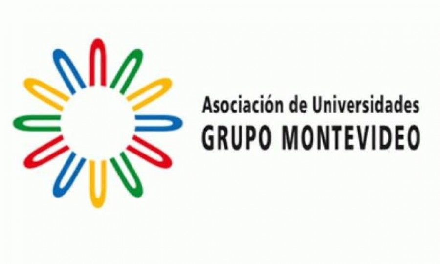
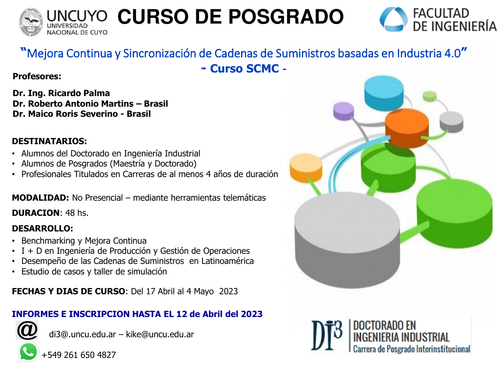

# MCSC_Op_4.0
## Mejora Continua y Sincronización de Cadenas de Suministros y Operaciones 4.0 en MOA

**Curso de doctorado**
-  Department of Industrial Federal University of Sao Carlos
-  Federal University of Goiás Operations Management, Sustainability & Solidary Economy
-  Institut of Industrial Engineer - National University of Cuyo

# Materiales del Curso / Materiais do curso

## Capítulo I
Medición del Desempeño de Cadenas de Suministros

[Link](Cap_1)

## Capítulo II
Metodología de la investigación en ingeniería de producción y gestión de operaciones

## Capítulo III
Pocesos Escenciales para SCM

## Capítulo IV
Casos de Estudio

## Capítulo V
Herramientas para la comunicación científica y formulación del trabajo final

