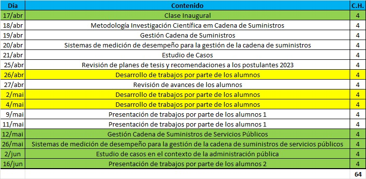

# MCSC_Op_4.0
## Mejora Continua y Sincronización de Cadenas de Suministros y Operaciones 4.0 en MOA

**Curso de doctorado**
-  Department of Industrial Federal University of Sao Carlos
-  Federal University of Goiás Operations Management, Sustainability & Solidary Economy
-  Institut of Industrial Engineer - National University of Cuyo

# Conectividad
Materiales en youtube y actividades asincrónicas
 [Link](Actividad_Sincrónica)

> Sala de para todas las clases del 17 al 21 de Abril

https://us06web.zoom.us/j/3126711049?pwd=cWdvSUx1bTY4UTU4c0xjZUt5STZvUT09

ID de reunión: 312 671 1049
Código de acceso: 251427

# Materiales del Curso / Materiais do curso

## Capítulo I
Medición del Desempeño de Cadenas de Suministros

[Link](Cap_1)

## Capítulo II
Metodología de la investigación en ingeniería de producción y gestión de operaciones

[Link](Cap_2)

## Capítulo III
Procesos Escenciales para SCM

[Link](Cap_3)

## Capítulo IV
Casos de Estudio

[Link](Cap_4)

## Capítulo V
Herramientas para la comunicación científica y formulación del trabajo final

[Link](Cap_5)

## Colaboradores (Profesores)

- @MaicoRorisSeverino
- @ramartins
- @ricardorpalma

## Alumnos:

- ESPOSITO Maria Fernanda (Arg) espositofernanda5@gmail.com
- LOPEZ LASTRA Leopoldo (Chi) Leopoldo.lopez.lastra@gmail.com
- MONGE GARCIA Marcelo G.(Ecu) marcelomg@live.com **Modelo de Gestión de la Tecnología y de la Innovación para las Unidades Productoras Agrícolas UPA.s de la provincia de Cotopaxi, Ecuador**
- NIEZWIDA Sonia Romina (Arg) rominaniezwida@gmail.com **Modelo cooperativo para la gestión de Residuos Sólidos Urbanos. Aplicación para el desarrollo sostenible de municipios de la provincia de Misiones.** 
- AMBRUSTOLO Mariela Beatriz (Arg)
- ATENCIO Marcos José (Arg) marcos.atencio@mi.unc.edu.ar **Energías renovables: potencial energético y transporte en Argentina** 
- BERARDI María Betina (Arg)
- CAJAMARCA CARRAZCO Diego Ivan (Ecu)
- ESTEBAN Alejandra María (Arg)
- MIGUELES Marina Alejandra (Arg)
- NOVILLO VILLEGAS Sylvia Mercedes (Ecu) sylvia.novillo@gmail.com
- QUEMEL PIRES Renata (Bra) dequemel@yahoo.com.br **LOGÍSTICA REVERSA: estruturar e analisar a cadeia reversa como diferencial na gestão integrada do ecoponto de resíduos sólidos para mobilizar uma economia circular no município**
- TORRES GÓMEZ Luis Patricio (Chi) ptazul2010@gmail.com **Madurez tecnológica 4.0 de la industria de transformación primaria de la madera: Propuesta de un modelo de madurez como herramienta para la determinación de estadios basales**
- VANELLA Marcelo Federico (Arg)
- ZÁRATE Claudia Noemí (Arg) cnzarate@gmail.com
- Joao Paulo Lopes Machado (Bra) joaopaulolm@ufg.br 
-	Juliana Rasmussen Cardoso (Bra) jrasmussen@ufg.br **Processos administrativos em museus universitários**
-	Samuel Amorim Oliveira (Bra) samuelamorim@discente.ufg.br **Sustentabilidade do extrativismo vegetal** 
-	Alysson Alvim Campos (Bra) alysson@crer.org.br 
-	Caio Cesar Medeiros Maciel (Bra) caiocesarmmaciel@gmail.com **REDUÇÃO DAS PERDAS POR MAKING-DO E MELHORIA DO PROCESSO DE CONSTRUÇÃO CIVIL** 
- Dayane de Cássia Galvão (Bra) dayanegalvao06@gmail.com **Motivação e engajamento de servidores na administração pública**
-	Leandro Pereira Cardoso (Bra) leandropcardoso20@gmail.com **Utilização de Jurimetria como ferramenta de organização no Poder Judiciário**
-	Luiz Fernando Pereira do Nascimento (Bra) luizfernandoedri@gmail.com 
-	Marcos Egberto Brasil de Melo (Bra) drmarcosmelo@gmail.com **Avaliação da Produtividade e Desempenho dos Servidores da Polícia Técnico-Científica de Goiás**
-	Rafael Camilo Nunes Ferreira de Paula (Bra) rafael.kamilol@gmail.com 
-	Vitória Rigo de Bacher (Bra) vitoria_debacher@hotmail.com 
-	Wagner Barcellos da Silva (Bra) zoraideemalu@gmail.com **Alocação de pessoas no setor público com base nas competências individuais e coletivas**
-	Grazyelle Costa da Silva Oliveira (Bra) grazyellecosta@discente.ufg.br **Estudo de cadeias de suprimentos de biomassas utilizadas para fitorremediação de solos contaminados** 
-	Laura Luiza Silva Lima (Bra) lauralima@discente.ufg.br **Estudo de cadeias de suprimentos sustentáveis de produtos com valor agregado de frutos do Cerrado para uso industrial e geração de renda para comunidades extrativistas do Nordeste Goiano**

# Grupo 1
Patricio Torres
